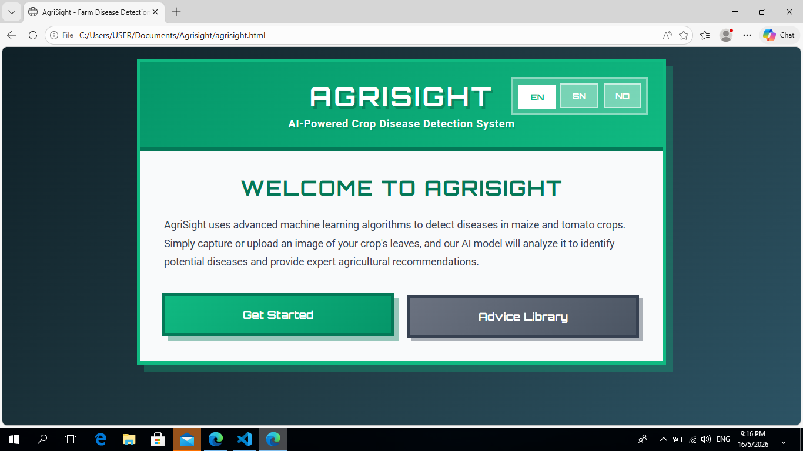

# AgriSight
AgriSight is an AI-powered crop disease detection website designed to help Zimbabwean farmers identify maize and tomato leaf diseases early using image recognition and TensorFlow.js. The platform provides multilingual farmer-friendly advice in English, Shona, and Ndebele to support sustainable farming and improve food security.

## How It Works 

AgriSight uses AI-powered image recognition to detect diseases in maize and tomato leaves. Users can upload an image or use their camera to scan a crop leaf. The AI model analyzes the image and predicts whether the crop is healthy or affected by disease.

After detection, AgriSight provides:
- Disease prediction results
- Confidence percentage scores
- Farmer-friendly treatment advice
- Prevention recommendations
- Multilingual support in English, Shona, and Ndebele

The platform is designed to help farmers identify crop diseases early, reduce crop losses, and improve food security.

## Tech Stack
- HTML5
- CSS3
- JavaScript
- TensorFlow.js
- Google Teachable Machine
- GitHub Pages (deployment)

## Features 
- AI crop disease detection
- Maize and tomato disease classification
- Camera and image upload support
- Real-time prediction analysis
- Multilingual interface
- Farming advice library
- Responsive design for mobile and desktop
